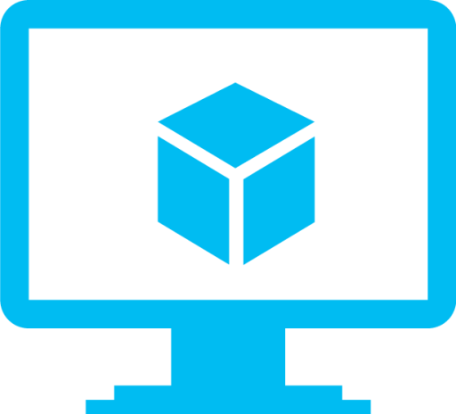

---
lab:
    title: 'VM Access'
    module: 'Virtual Machine Access via Microsoft Learn'
---

# Access a virtual machine

If your organization won't allow you to download and install software, you can use a virtual machine (VM) to complete the labs.

We are accessing virtual machines through Microsoft Learn. These VMs have limited capacity, so if the VM you select is unavailable, please try another one.
| VM | 
|----------|
| [VM 1](https://learn.microsoft.com/training/modules/design-model-power-bi/8-lab)   |
| [VM 2](https://learn.microsoft.com/training/modules/dax-power-bi-time-intelligence/3b-lab)    | 
| [VM 3](https://learn.microsoft.com/training/modules/dax-power-bi-add-measures/5b-lab)    | 

## Instructions

1. **Click on the link** for the VM you want to use.
2. **Sign in with your Microsoft account** (organizational or personal - use the account you have associated with Microsoft Learn, this is ordinarily your corporate account).
3. **Log onto the VM** using the credentials provided in the lab.
4. In Microsoft Edge, **navigate to the [course website](https://shannonlindsay.github.io/WitchesGuide/Instructions/Labs/03-UseTools.html)**.
5. Download the data files and any other resources needed for the lab.
6. Download Tabular Editor 2.
7. Download DAX Studio.
8. Open Power BI Desktop and connect to the data files.
9. Follow the lab instructions as written.